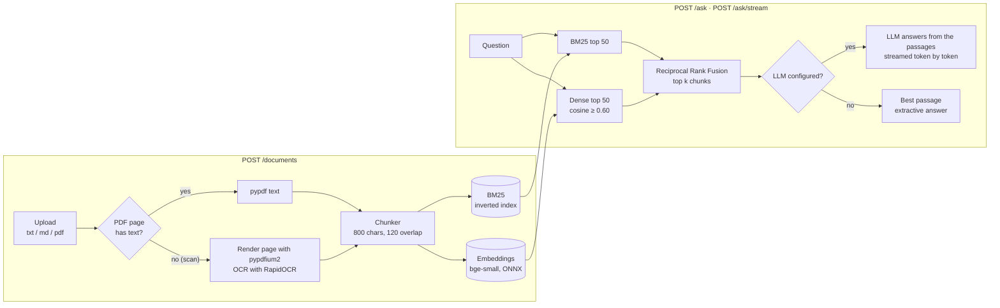
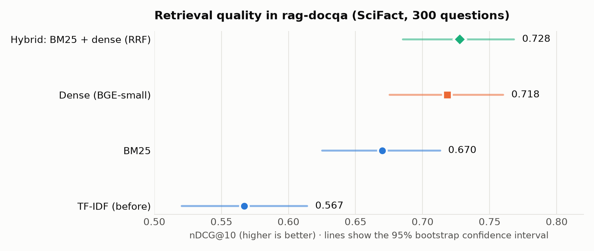

# RAG Document QA

A retrieval-augmented generation (RAG) service. Upload documents (`.txt`, `.md`, `.pdf`, including **scanned PDFs**), ask questions, and get answers **grounded in and cited from** those documents, streamed word by word, with the file and page each answer came from.


*The demo uploads a scanned PDF (text read with OCR), asks a question and streams the answer, citing `scanned-report.pdf, p. 1`.*

## Features

- **Hybrid retrieval**: BM25 (exact words) + dense embeddings (meaning), merged with Reciprocal Rank Fusion. **nDCG@10 0.728 vs 0.567 for the original TF-IDF** on a labelled benchmark ([results](#retrieval-evaluation))
- **Retrieval evaluation** on a human-labelled question set (BEIR SciFact): recall@k, MRR, nDCG and significance tests, reproducible with one command
- **Streaming answers** over Server-Sent Events (`POST /ask/stream`), plus a small web page at `/`
- **OCR for scanned PDFs**: pages without a text layer are rendered and read with RapidOCR (about 0.8 s per page); mixed PDFs keep their page numbers
- **Off-topic questions find nothing**: a dense similarity floor, calibrated on data, rejects 87% of unrelated questions while keeping 99% of correct matches
- **Grounded answers with citations** from Claude or any Anthropic-compatible endpoint (e.g. Ollama Cloud); **works without an API key** by returning the best passage, also when the LLM is unreachable
- **Smaller Docker image**: multi-stage build, 15% smaller than a single-stage build with the same features; non-root, health check, model baked in so it runs offline
- **Persistent index**: chunks and embeddings survive restarts (no re-embedding); re-uploading a file replaces it

## How it works



1. **Load** (`loaders.py`, `ocr.py`): text files as one page; PDFs page by page with `pypdf`. Pages with no text layer (scans) are rendered with `pypdfium2` and read with RapidOCR. Pages that already have text skip OCR.
2. **Chunk** (`chunking.py`): ~800-character overlapping chunks (LangChain `RecursiveCharacterTextSplitter`), each keeping its file and page.
3. **Index and retrieve** (`retriever.py`):
   - **BM25** over stemmed words, with an inverted index and Lucene's always-positive IDF.
   - **Dense**: `BAAI/bge-small-en-v1.5` embeddings through `fastembed` (ONNX Runtime, no PyTorch); cosine similarity, with hits below 0.60 dropped.
   - **Hybrid**: each returns its top 50, merged with Reciprocal Rank Fusion, `score = Σ 1 / (60 + rank)`.
4. **Generate** (`generator.py`): the numbered passages go to the LLM with instructions to answer only from them and cite `[1]`, `[2]`; `stream()` yields the answer as it is written.
5. **Serve** (`api.py`): FastAPI endpoints, Server-Sent Events for streaming, and the web page.

## Retrieval evaluation

Retrieval is measured on **SciFact** from the [BEIR benchmark](https://arxiv.org/abs/2104.08663): 5,183 scientific abstracts, each ingested like an uploaded file and chunked by the app (17,353 chunks), and **300 questions with human-labelled relevant documents**. A hit is a retrieved chunk from a relevant document.

<picture>
  <source media="(prefers-color-scheme: dark)" srcset="docs/retrieval_dark.png">
  
</picture>

| Retriever | Recall@1 | Recall@5 | Recall@10 | MRR@10 | nDCG@10 | ms / question |
|:--|--:|--:|--:|--:|--:|--:|
| TF-IDF (before) | 0.406 | 0.658 | 0.724 | 0.522 | 0.567 | 6.2 |
| BM25 | 0.531 | 0.735 | 0.806 | 0.633 | 0.670 | 0.2 |
| Dense (bge-small) | 0.574 | 0.777 | 0.848 | 0.683 | 0.718 | 7.6 |
| **Hybrid (default)** | **0.580** | **0.794** | **0.855** | **0.693** | **0.728** | 9.7 |

Is the difference real? Paired randomization test on per-question nDCG@10:

| A | B | A − B | p-value | Significant? |
|:--|:--|--:|--:|:--|
| BM25 | TF-IDF | +0.103 | < 0.001 | yes |
| Dense | BM25 | +0.048 | 0.003 | yes |
| Hybrid | TF-IDF | +0.161 | < 0.001 | yes |
| Hybrid | BM25 | +0.058 | < 0.001 | yes |
| Hybrid | Dense | +0.009 | 0.431 | **no** |

- **Hybrid improves recall@10 from 0.724 to 0.855**: 13 more of every 100 relevant documents reach the top 10 that the LLM sees.
- **Hybrid and dense are statistically tied on SciFact.** Hybrid is still the default because BM25 costs almost nothing (0.2 ms) and catches rare exact terms (product codes, drug names, IDs) that small embedding models miss. My [retrieval-eval-bench](https://github.com/abhisheklakhani-it/retrieval-eval-bench) project shows such cases.
- **Why TF-IDF was weak here**: abstracts are split into ~3.3 chunks and only the first chunk has the title. Stemming (BM25) and meaning-based matching (dense) cope with that much better.

**Similarity floor for off-topic questions**: dense search always returns *something*, so hits below a cosine of 0.60 are dropped. The value was chosen from data (`scripts/calibrate_min_score.py`): it keeps 98.8% of the correct matches for the 300 questions and rejects 26 of 30 off-topic questions (cooking, travel, sports…). It does not change the scores above (nDCG@10 stays 0.728). Off-topic questions then get "No relevant passages were found".

## Docker image size

Measured on an Apple M2 (linux/arm64) with `docker image ls` (disk) and the compressed content size (download):

| Image | Disk | Compressed |
|:--|--:|--:|
| Before: TF-IDF, single-stage | 734 MB | 153 MB |
| New features, single-stage build | 1.04 GB | 288 MB |
| **New features, multi-stage build (this repo)** | **889 MB** | **257 MB** |

The multi-stage build installs everything in a *builder* stage, then copies only the finished virtual environment and the model into a fresh slim image. Along the way it swaps RapidOCR's full OpenCV for the **headless** build (no GUI libraries), and removes pip, test suites and bytecode caches. The result is 15% smaller on disk and 11% smaller to download than a single-stage build with the same features. (Both new-feature images already leave out scikit-learn and SciPy, which BM25 made unnecessary at runtime.) It is still larger than the original image, because it now contains an embedding model (65 MB), ONNX Runtime (54 MB) and OCR (OpenCV + models, about 120 MB).

## Quick start

### With Docker

```bash
git clone https://github.com/abhisheklakhani-it/rag-docqa.git
cd rag-docqa
cp .env.example .env        # optional: add a key for LLM answers (Claude or Ollama Cloud)
docker compose up --build
```

Open **http://localhost:8000** for the web page or **http://localhost:8000/docs** for the interactive API docs.

### Locally

```bash
python3 -m venv .venv && source .venv/bin/activate
pip install -r requirements-dev.txt
cp .env.example .env        # optional
PYTHONPATH=src uvicorn ragqa.api:app --env-file .env --reload
```

The first start downloads the embedding model (about 65 MB).

## Example

```bash
curl -F file=@data/sample/onnx_runtime.md localhost:8000/documents
curl -F file=@scan.pdf localhost:8000/documents
# {"source": "scan.pdf", "pages": 1, "chunks": 1, "replaced": false, "ocr_pages": [1]}

curl -N localhost:8000/ask/stream -H 'content-type: application/json' \
     -d '{"question": "How much faster did int8 quantization make CPU inference on our servers?", "top_k": 3}'
```

Real streamed response with `gpt-oss:120b` on Ollama Cloud (Server-Sent Events; sources shortened):

```text
event: sources
data: [{"source": "scan.pdf", "page": 1, "chunk": 0, "score": 0.0328, "text": "Quarterly Report 2026\nInt8 quantization made CPU inference\nabout three times faster on our servers."}, …]

event: token
data: {"text": "Int"}

event: token
data: {"text": "8 quantization made CPU inference"}

event: token
data: {"text": " about three "}

event: token
data: {"text": "times faster on our servers【"}

event: token
data: {"text": "1】."}

event: done
data: {"mode": "llm"}
```

`POST /ask` returns the same answer in one JSON response. Without an API key, `mode` is `"extractive"` and the answer is the best-matching passage.

## API

| Method | Path | Description |
|---|---|---|
| `GET` | `/` | Web page: upload, ask, watch the answer stream |
| `GET` | `/health` | Status, number of documents and chunks, retriever, active LLM |
| `GET` | `/documents` | List indexed documents |
| `POST` | `/documents` | Upload and index a `.txt` / `.md` / `.pdf` file (multipart field `file`); returns `ocr_pages`; re-uploading replaces it |
| `DELETE` | `/documents/{name}` | Remove a document from the index |
| `POST` | `/ask` | `{"question": str, "top_k"?: int}` → `answer`, `mode` (`llm` / `extractive`), `sources` |
| `POST` | `/ask/stream` | Same request; Server-Sent Events: `sources`, then `token`s, then `done` (or `error`) |

Errors: `400` unsupported or unreadable file · `404` unknown document · `413` file too large · `422` invalid request.

## Configuration

All settings are environment variables (see `src/ragqa/config.py` and `.env.example`):

| Variable | Default | Description |
|---|---|---|
| `ANTHROPIC_API_KEY` | – | Enables LLM answers with Claude |
| `ANTHROPIC_BASE_URL` / `ANTHROPIC_AUTH_TOKEN` | – | Any Anthropic-compatible endpoint, e.g. `https://ollama.com` with an Ollama key |
| `RAGQA_MODEL` | `claude-opus-5` | Model ID (e.g. `gpt-oss:120b` on Ollama Cloud) |
| `RAGQA_LLM` | `auto` | `auto` (use the LLM if a key is set), `claude`, or `none` |
| `RAGQA_RETRIEVER` | `hybrid` | `hybrid`, `bm25`, `dense`, or `tfidf` (needs scikit-learn) |
| `RAGQA_EMBEDDING_MODEL` | `BAAI/bge-small-en-v1.5` | fastembed model for dense and hybrid retrieval |
| `RAGQA_MIN_DENSE_SCORE` | `0.60` | Dense similarity floor (calibrated for bge-small; recalibrate if you change the model) |
| `RAGQA_OCR` | `auto` | `auto` (OCR pages without text) or `off` |
| `RAGQA_TOP_K` | `4` | Passages per question |
| `RAGQA_CHUNK_SIZE` / `RAGQA_CHUNK_OVERLAP` | `800` / `120` | Chunking parameters (characters) |
| `RAGQA_MAX_UPLOAD_MB` | `20` | Maximum upload size |
| `RAGQA_INDEX_DIR` | `index` | Where chunks and embeddings are stored |

## Reproduce the evaluation

```bash
python scripts/evaluate_retrieval.py --retriever tfidf    # also: bm25, dense, hybrid
python scripts/compare_retrievers.py                       # tables + significance tests
python scripts/calibrate_min_score.py                      # similarity floor
python scripts/plot_eval.py                                # chart
```

The dataset (3 MB) is downloaded to `data/eval/` on first use. Embedding the 17,353 chunks took about 21 minutes on an M2 CPU; the vectors are cached, so later runs take seconds. Raw results are in `results/`.

## Tests

```bash
pytest -v
```

73 tests, no network or API key needed:

- **Retrievers**: BM25, dense, hybrid and TF-IDF on a small corpus (a fake embedder replaces the model), save/load without re-embedding, removal, similarity floor, RRF, and a regression test for the one-document BM25 bug.
- **Streaming**: SSE event order, token streaming with a fake LLM, fallback when the LLM is unreachable, refusal handling.
- **OCR**: generated "scanned" PDFs (image only, rotated and blurred) are read correctly; mixed text/scan PDFs keep page numbers; OCR can be turned off.
- **Evaluation metrics**, every API endpoint, PDF loading and bad-file handling.

## Project structure

```
src/ragqa/
  api.py            FastAPI endpoints, SSE streaming, web page route
  config.py         settings from environment variables
  loaders.py        txt / md / pdf → page texts (OCR for scanned pages)
  ocr.py            render PDF pages and read them with RapidOCR
  chunking.py       page texts → overlapping chunks
  retriever.py      BM25, dense, hybrid (RRF), TF-IDF; persistence
  generator.py      prompt building, answers and streaming
  evaluation.py     labelled-set loader, metrics, significance test
  static/index.html the web page
scripts/            evaluation, calibration, chart and demo GIF
results/            evaluation results (JSON / Markdown)
tests/              pytest suite
data/sample/        sample documents to try
```

## Design decisions

- **Measure first.** An evaluation harness was built before changing retrieval, so every change has a number: TF-IDF 0.567 → hybrid 0.728 nDCG@10.
- **Reciprocal Rank Fusion instead of tuned score weights.** RRF uses only ranks, so BM25 scores and cosine similarities need no rescaling, and it needs no tuning. A weight tuned on one dataset would not carry over to users' documents. In retrieval-eval-bench, tuned weighted fusion was not significantly better than RRF.
- **fastembed (ONNX Runtime) instead of sentence-transformers.** Same model, no PyTorch (over 1 GB), which keeps the Docker image smaller.
- **Own BM25 instead of `rank_bm25`.** The library's Okapi IDF goes negative for words in over half the chunks, so an index with one uploaded document returned nothing (found by a test). Lucene's IDF is always positive; the inverted index is also about 50× faster (0.2 vs 12 ms per question) with the same quality.
- **RapidOCR instead of Tesseract.** Pure pip install (no system package), reuses ONNX Runtime, bundles its models. An older model version dropped spaces between English words; v3's bundled PP-OCRv6 model reads them correctly.
- **Graceful degradation.** Without an API key, or when the LLM fails before streaming starts, the service returns the best passage instead of an error.

## Limitations

- **Embedding is CPU-heavy**: about 42 ms per chunk on an M2 (6 seconds for a 150-chunk upload). Large collections need a GPU or a batch job.
- **OCR is not perfect**: in the demo it read "Quarterly Engineering Report" as "Quarterly EngineeringReport". Handwriting and low-quality scans will be worse.
- **The similarity floor is a trade-off**: 4 of 30 off-topic questions still passed, and it removes off-topic documents, not less-relevant ones on the same topic. It is calibrated for one embedding model and one domain.
- **One evaluation dataset**: SciFact is scientific English; other domains may rank the methods differently.
- **Streaming errors after the first token** cannot fall back to the extractive answer; the client gets an `error` event instead.

## Roadmap

- [x] PDF ingestion with page numbers
- [x] Dense embeddings and hybrid (BM25 + vector) retrieval
- [x] Retrieval evaluation (recall@k, MRR, nDCG) on a labelled question set
- [x] Streaming answers
- [x] OCR for scanned PDFs
- [x] Smaller Docker image (multi-stage build)
- [ ] Cross-encoder reranking of the top 20 chunks
- [ ] Answer-quality evaluation (faithfulness of the LLM answers to the sources)
- [ ] Chunk-size tuning on the evaluation set
