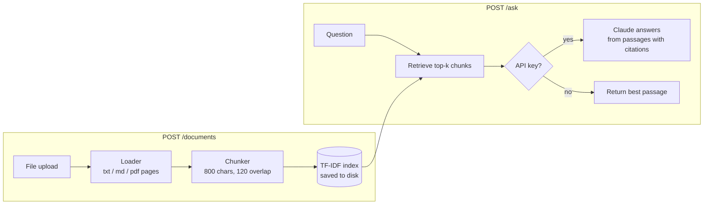

# RAG Document QA

A retrieval-augmented generation (RAG) service. Upload documents (`.txt`, `.md`, `.pdf`), ask questions, and get answers **grounded in and cited from** those documents, with the file and page each answer came from.


## Features

- **Upload `.txt`, `.md` and `.pdf`**: PDFs are read page by page, so answers can cite `report.pdf, p. 3`
- **TF-IDF retrieval** (unigrams + bigrams): fast, needs no GPU or embedding API
- **Grounded answers with citations** from Claude: the model answers only from the retrieved passages and says so when they don't contain the answer
- **Works without an API key**: falls back to returning the best-matching passage (extractive mode), and does the same if the LLM API is unreachable
- **Persistent index**: documents survive restarts; re-uploading a file replaces it
- **Clear errors**: unsupported, empty, corrupted, scanned (no text) or oversized files are rejected with a helpful message
- **Dockerized**: non-root container with a health check and a volume for the index

## How it works



1. **Load**: `loaders.py` turns the upload into page texts (`pypdf` for PDFs).
2. **Chunk**: `chunking.py` splits pages into ~800-character overlapping chunks with LangChain's `RecursiveCharacterTextSplitter`, keeping the source file and page number.
3. **Index and retrieve**: `retriever.py` builds a TF-IDF matrix (scikit-learn) and ranks chunks by cosine similarity to the question.
4. **Generate**: `generator.py` sends the numbered passages to Claude with instructions to answer only from them and cite `[1]`, `[2]`.
5. **Serve**: `api.py` exposes it all as a FastAPI REST API.

## Quick start

### With Docker

```bash
git clone https://github.com/abhisheklakhani-it/rag-docqa.git
cd rag-docqa
cp .env.example .env        # optional: add ANTHROPIC_API_KEY for LLM answers
docker compose up --build
```

Open **http://localhost:8000/docs** for the interactive API docs.

### Locally

```bash
python3 -m venv .venv && source .venv/bin/activate
pip install -r requirements-dev.txt
export ANTHROPIC_API_KEY=...  # optional
PYTHONPATH=src uvicorn ragqa.api:app --reload
```

## Example

```bash
curl -F file=@data/sample/federated_learning.md localhost:8000/documents
curl -F file=@data/sample/onnx_runtime.md localhost:8000/documents

curl -s localhost:8000/ask -H 'content-type: application/json' \
     -d '{"question": "Why are Solid PODs useful for federated learning?", "top_k": 2}'
```

Response (extractive mode, no API key; texts shortened):

```json
{
  "answer": "# Federated Learning\n\nFederated learning trains a shared model across many devices or data silos without moving raw data...",
  "mode": "extractive",
  "sources": [
    { "source": "federated_learning.md", "page": null, "chunk": 0, "score": 0.3605, "text": "# Federated Learning..." },
    { "source": "onnx_runtime.md",       "page": null, "chunk": 0, "score": 0.0213, "text": "# ONNX Runtime..." }
  ]
}
```

With an API key set, `mode` is `"llm"` and `answer` is a written answer that cites the passages it used as `[1]`, `[2]`.

## API

| Method | Path | Description |
|---|---|---|
| `GET` | `/health` | Status, number of documents and chunks, active LLM |
| `GET` | `/documents` | List indexed documents |
| `POST` | `/documents` | Upload and index a `.txt` / `.md` / `.pdf` file (multipart field `file`); re-uploading replaces it |
| `DELETE` | `/documents/{name}` | Remove a document from the index |
| `POST` | `/ask` | `{"question": str, "top_k"?: int}` → `answer`, `mode` (`llm` / `extractive`), `sources` |

Errors: `400` unsupported or unreadable file · `404` unknown document · `413` file too large · `422` invalid request.

## Configuration

All settings are environment variables (see `src/ragqa/config.py`):

| Variable | Default | Description |
|---|---|---|
| `ANTHROPIC_API_KEY` | – | Enables LLM answers |
| `RAGQA_LLM` | `auto` | `auto` (use Claude if a key is set), `claude`, or `none` |
| `RAGQA_MODEL` | `claude-opus-5` | Claude model ID |
| `RAGQA_TOP_K` | `4` | Passages retrieved per question |
| `RAGQA_CHUNK_SIZE` / `RAGQA_CHUNK_OVERLAP` | `800` / `120` | Chunking parameters (characters) |
| `RAGQA_MAX_UPLOAD_MB` | `20` | Maximum upload size |
| `RAGQA_INDEX_DIR` | `index` | Where the index is stored |

## Tests

```bash
pytest -v
```

34 tests cover chunking, retrieval ranking, PDF loading and bad-file handling, prompt building and refusal fallback (with a mocked LLM client), and every API endpoint, including index persistence across restarts. The tests need no API key or network.

## Project structure

```
src/ragqa/
  api.py         FastAPI app and endpoints
  config.py      settings from environment variables
  loaders.py     txt / md / pdf → page texts
  chunking.py    page texts → overlapping chunks
  retriever.py   TF-IDF index, search, persistence
  generator.py   prompt building and Claude answers
tests/           pytest suite
data/sample/     sample documents to try
```

## Design decisions

- **TF-IDF instead of embeddings:** a strong, cheap baseline with no model downloads or embedding costs. Its limitation is that it matches words, not meaning ("car" won't match "vehicle"). Hybrid retrieval is on the roadmap.
- **Page-level citations:** chunks keep their page number so every answer can be checked against the source.
- **Graceful degradation:** the service stays useful without an API key and when the LLM API fails.

## Roadmap

- [x] PDF ingestion with page numbers
- [ ] Dense embeddings and hybrid (TF-IDF/BM25 + vector) retrieval
- [ ] Retrieval evaluation (recall@k, MRR) on a labelled question set
- [ ] Streaming answers
- [ ] OCR for scanned PDFs
- [ ] Smaller Docker image (multi-stage build)
